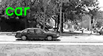
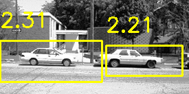

Lab08 :

问题与内容描述：基于opencv的物体检测与跟踪

包含：

- detect_people_hog.py  （HOG 行人检测示例）
- detect_car_bow_svm.py （BoW + SVM 车辆检测示例）
- detect_car_bow_svm_sliding_window.py （BoW + SVM + 金字塔 + 滑窗 + NMS）
- non_max_suppression.py （非极大值抑制实现）
- requirements.txt （依赖列表）

文件夹：

* data——代码运行所需数据
* result——代码运行结果
* image——README文档配图

环境配置：Python 3.13.9+opencv4.12

一键配置命令：

conda env create -f environment_opencv46.yml

运行结果：

- 行人检测（HOG）：
  python detect_people_hog.py
  运行结果如下：
  
- 车辆 BoW+SVM（单张测试）：
  python detect_car_bow_svm.py
  运行结果如下：
  
- 车辆 BoW+SVM（滑窗金字塔检测）：
  python detect_car_bow_svm_sliding_window.py
  
